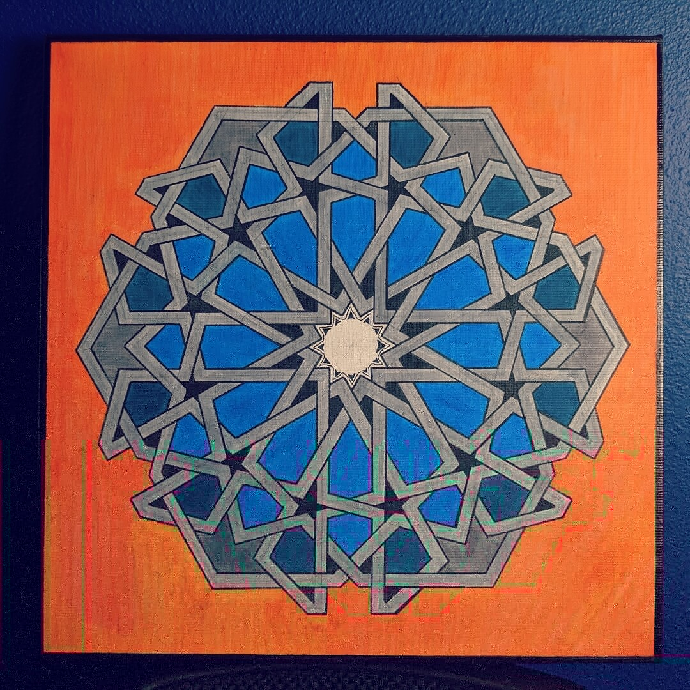
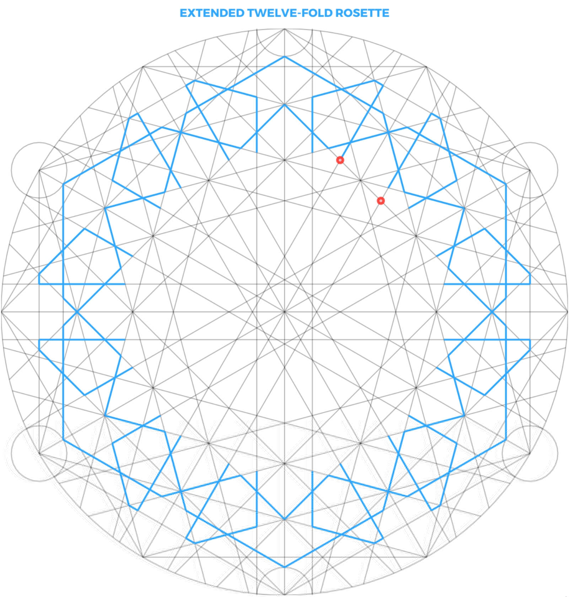

# My Newfound Inner Artist

<!--
cSpell:ignore Ibn Tulun
cSpell:ignore Md Amir Salmani
cSpell:ignore Michal Huniewicz
-->

I want to share something that I learned over the last year. Growing up, my curiosity was always triggered by rules and numbers. If I can construct a logical set of rules that I can follow to do something, I'd be able to focus and complete it. Naturally, this made me steer away from any artistic hobbies. To me, Art was , well, **_artistic_**, **_whimsical_**, needed **_talent_**, and **_imagination_**. Things I thought I lacked. Things I never understood.

Over the last year, I made it a goal to focus on at least one type of art, and explore why did I stay away from it for so long. After a long discussion with a great friend of mine, they encouraged me to give it another shot. I decided to start with one kind of art that had always fascinated me. Arabic/Islamic Geometry.

<figure markdown>
  { loading=lazy }
  <figcaption>Arches of the Ibn Tulun Mosque in Cairo, by Michal Huniewicz.</figcaption>
</figure>

Growing up in Egypt, home to some of the most interesting architecture in the world, and during some of my trips, I came across many historic buildings and constructions that had this type of design/geometry, both on their walls, or as part of the design/construction. I found myself thinking a lot about how they are created. What process and rules govern this extremely accurate art, and whether there is some logic/rules that can be studied and followed to create more of it.

After a few YouTube videos, books, and a bunch of random articles, I fell in love with that art. For hundreds of years, artists only used the most basic tools to accomplish these designs. A ruler, a pen, and a compass. Nothing else. Using a basic set of steps, they would create the most intricate polygons, circles, and locks. You can imagine the kind of mathematical genius that used only these tools to carve a 100ft wall, and without one inch of error.

Most of their work was done on paper, leather, and stone. Later on, iron, bronze, and other types of metal work were introduced as a medium of this art, and computers enabled creating these designs on a much bigger scale.

<figure markdown>
  { loading=lazy }
  <figcaption>An interesting roof in Medina, by Md Amir Salmani.</figcaption>
</figure>

I came to a life-changing realization. Art is just like science (well, kind-of). It can have rules, and people can develop certain measures and logical algorithms to produce something that is **_aesthetically pleasing_**. It is both amazing and humbling that I get to learn about all of that now. The engineer in me kicked in, and suddenly, I started doing art!

<figure markdown>
  { loading=lazy }
  <figcaption>Original Design, by me.</figcaption>
</figure>

That was not enough of course. I started watching more tutorials, and going through more books/manuals. Eventually, prototyping designs on paper was too slow for me, so I created a little app that lets me design and render these constructions quickly, and scale them as much as I want.

<figure markdown>
  { loading=lazy }
  <figcaption>Original Design, by me.</figcaption>
</figure>

I'm planning to explore more forms of this art, and prototype a few more things before my eventual boredom kicks in and I start learning something new. I hope this post inspires you to explore this art form, and maybe create something out of it!
